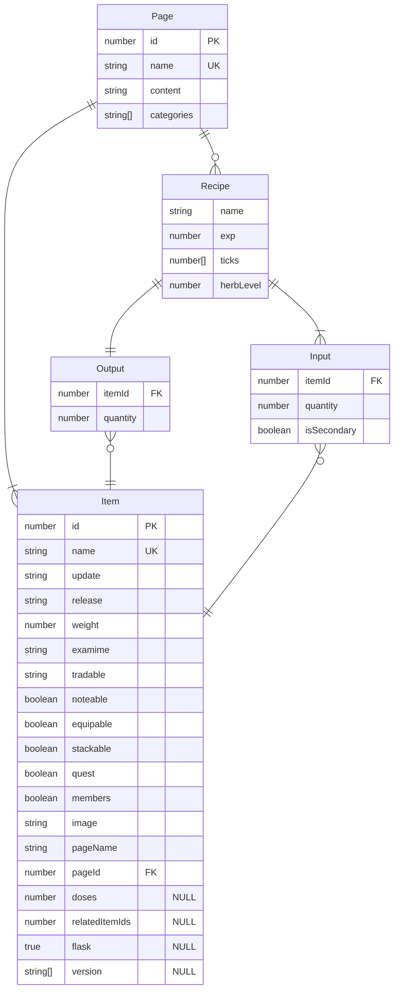

```mermaid
erDiagram
  Page ||--|{ Item : ""
  Page ||--o{ Recipe : ""
  Recipe ||--|| Output : ""
  Recipe ||--|{ Input : ""
  Output }o--|| Item : ""
  Input }o--|| Item : ""

  Item {
    number id PK
    string name UK
    string update
    string release
    number weight
    string examime
    string tradable
    boolean noteable
    boolean equipable
    boolean stackable
    boolean quest
    boolean members
    string image
    string pageName
    number pageId FK
    number doses "NULL"
    number relatedItemIds "NULL"
    true flask "NULL"
    string[] version "NULL"
  }

  Page {
    number id PK
    string name UK
    string content
    string[] categories
  }

  Recipe {
    string name
    number exp
    number[] ticks
    number herbLevel
  }

  Output {
    number itemId FK
    number quantity
  }

  Input {
    number itemId FK
    number quantity
    boolean isSecondary
  }
```